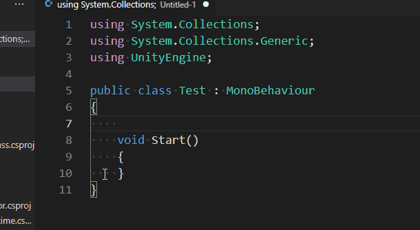
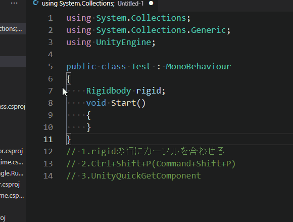

# UnityQuickGetcomponent README

# Features
この拡張機能を使うと、Start()で行われるGetComponentと、RequireComponentを自動で入力できます。
 
 
まずは入れたい変数の宣言文を入力してください。
void Start(){}も必要です。

 
 
次に宣言文の行にカーソルを合わせた状態でCtrl＋Shift＋P(Command+Shift+P)でコマンドパレットを開き、UnityQuickGetComponentを呼び出します。

GetComponentとRequireComponentを自動で入力します。

分かりやすさのため範囲選択していますが、カーソルを合わせるだけでも起動可能です。

# Requirements
拡張機能は言語モードがC#の場合に有効になります。

# Release Notes

## 1.0.0
Initial release of 'UnityQuickGetComponent'
